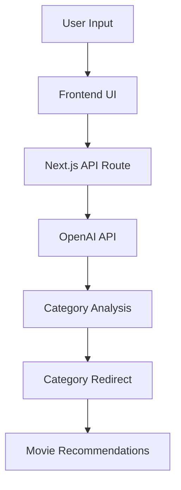

# MovieAI - AI-Powered Movie Recommendation System

MovieAI is a modern web application that uses artificial intelligence to provide personalized movie recommendations based on user preferences and natural language descriptions.


## 🌟 Features

- **Natural Language Processing**: Describe your movie preferences in plain English
- **AI-Powered Analysis**: Advanced analysis of user preferences using OpenAI's GPT-3.5
- **Category-Based Recommendations**: Smart categorization of preferences into specific genres
- **Modern UI/UX**: Sleek dark theme with smooth animations and transitions
- **Responsive Design**: Fully responsive across all devices
- **Real-time Analysis**: Instant processing and redirection to relevant categories

## 🔧 Technology Stack

- **Frontend**:
  - Next.js 14 (React Framework)
  - TypeScript
  - Tailwind CSS
  - Framer Motion
  - Material-UI Icons

- **Backend**:
  - Next.js API Routes
  - OpenAI GPT-3.5

## 🏗️ Architecture



## 📊 API Flow

```plaintext
1. User Input
   └── Natural language description of preferences
       └── Frontend validation
           └── API Request (/api/analyze)
               └── OpenAI Processing
                   └── Category Determination
                       └── Response & Redirect

API Request Format:
POST /api/analyze
{
    "query": "string" // User's movie preference description
}

API Response Format:
{
    "category": "string",  // Determined movie category
    "confidence": number,  // Confidence score (0-1)
    "error": "string"     // Error message if any
}
```

## 🚀 Getting Started

### Prerequisites

- Node.js 18.0 or higher
- npm or yarn
- OpenAI API key

### Installation

1. Clone the repository:
```bash
git clone https://github.com/kalzimkholodros/Next-MovieRecommenderAI.git
cd folder-name
```

2. Install dependencies:
```bash
npm install
# or
yarn install
```

3. Set up environment variables:
```bash
cp .env.example .env.local
```
Edit `.env.local` and add your OpenAI API key:
```
OPENAI_API_KEY=your_api_key_here
```

4. Run the development server:
```bash
npm run dev
# or
yarn dev
```

5. Open [http://localhost:3000](http://localhost:3000) in your browser.

## 📁 Project Structure

```
movie-management-ai/
├── app/
│   ├── api/
│   │   └── analyze/
│   │       └── route.ts
│   ├── categories/
│   │   └── page.tsx
│   ├── category/
│   │   └── [slug]/
│   │       └── page.tsx
│   ├── about/
│   │   └── page.tsx
│   └── page.tsx
├── components/
│   └── Navbar.tsx
├── public/
│   └── assets/
├── styles/
│   └── globals.css
├── types/
│   └── index.ts
└── utils/
    └── api.ts
```

## 🎨 UI Components

### Main Pages
- **Home**: Natural language input for movie preferences
- **Categories**: Grid layout of movie genres with animations
- **Category Detail**: Specific genre recommendations
- **About**: Project information and features

### Shared Components
- **Navbar**: Responsive navigation with MUI icons
- **Loading States**: Animated loading indicators
- **Error Handling**: User-friendly error messages
- **Animations**: Page transitions and hover effects

## 🔄 State Management

- React's useState for local component state
- Server-side data fetching with Next.js
- API response caching for improved performance

## 🎯 Future Enhancements

- [ ] User authentication and profiles
- [ ] Personalized recommendation history
- [ ] Advanced filtering options
- [ ] Integration with movie databases (TMDB, IMDB)
- [ ] Social sharing features
- [ ] Watch later functionality
- [ ] Rating system

## 🔒 Security

- Environment variables for sensitive data
- API rate limiting
- Input sanitization
- Error boundary implementation

## 📈 Performance

- Optimized images and assets
- Code splitting and lazy loading
- Minimal bundle size
- Efficient API calls

## 🤝 Contributing

1. Fork the repository
2. Create your feature branch (`git checkout -b feature/AmazingFeature`)
3. Commit your changes (`git commit -m 'Add some AmazingFeature'`)
4. Push to the branch (`git push origin feature/AmazingFeature`)
5. Open a Pull Request

## 📝 License

This project is licensed under the MIT License - see the [LICENSE](LICENSE) file for details.

## 👥 Authors

- Your Name - Initial work - [YourGithub](https://github.com/yourusername)

## 🙏 Acknowledgments

- OpenAI for GPT-3.5 API
- Next.js team for the amazing framework
- Vercel for hosting and deployment
- All contributors and supporters

---

For more information or support, please open an issue or contact the maintainers. 
